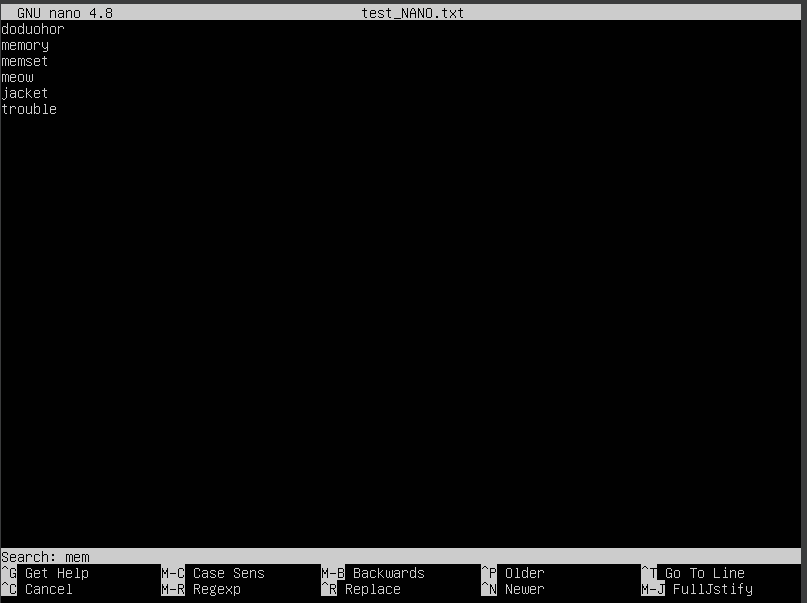
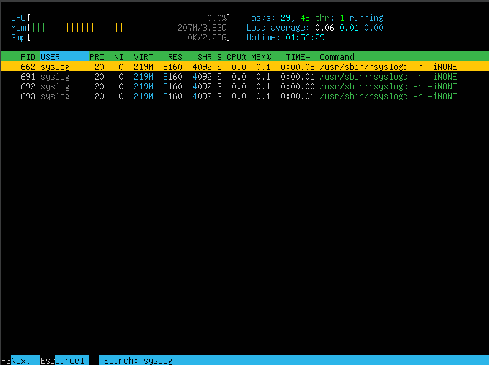
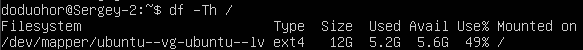

## Part 1.
- Устанавливаем **Ubuntu 20.04 Server LTS** без графического интерфейса и узнаем версию Ubuntu, выполнив команду `cat /etc/issue`. 
 

---

## Part 2.

- Создаем пользователя и добавляем его в группу adm. 
 
- Проверяем, что пользователь добавился в группу 
 

---

## Part 3.
- Задаем название машины вида user-1. 
 

- Устанавливаем временную зону, соответствующую текущему местоположению. 
 

- Выводим названия сетевых интерфейсов с помощью консольной команды и даем объяснение наличию интерфейса lo. 
 

Сетевой интерфейс lo, также известный как "Loopback", является специальным сетевым интерфейсом, который всегда присутствует на каждом компьютере или сервере. Он служит для локальной петли (loopback) и используется для обмена данными с самим собой, без отправки данных во внешнюю сеть. 

- Используя консольную команду получаем ip адрес устройства, на котором работаем, от DHCP сервера и даем расшифровку DHCP. 
 

DHCP расшифровывается как "Dynamic Host Configuration Protocol" или "Протокол динамической настройки хоста". Это сетевой протокол, который используется для автоматической настройки сетевых параметров устройства, таких как IP-адрес, маска подсети, шлюз по умолчанию, DNS-серверы и другие настройки, необходимые для его подключения к локальной сети и Интернету. 

- Определили и вывели на экран внешний ip-адрес шлюза (ip) и внутренний IP-адрес шлюза, он же ip-адрес по умолчанию (gw). 
 

- Задаем статичные настройки ip, gw, dns . 
 

- Пропинговываем 1.1.1.1 и ya.ru. 
 

---

## Part 4.

- Обновляем системные пакеты до последней версии. 

---

## Part 5.

- Даем разрешение ранее добавленному пользователю на выполнение команды sudo.

1. Вводим команду `sudo visudo` и добавляем нашего пользователя после строчки: User privilege specification

2. Задаем пароль пользователю, чтобы мы могли на него переключиться 
")

3. Меняем hostname ОС, тем самым проверяя доступ к команде `sudo`

---

## Part 6.

- Проверем работу службы автоматической синхронизации времени.

---

## Part 7.

- Устанавливаем текстовые редакторы VIM, NANO и Emacs с помощью команды `sudo apt install "название редактора"`.

1. Создаем файл и добавляем свой ник, после чего закрываем с сохранением изменений.
2. Редактируем файл, вместо ника вводим "21 School 21" и закрываем без сохранения изменений.
3. Ищем необходимое слово.
4. Заменяем одно слово на другое.

### VIM
1. 
2. 
3. 
4. 

#### Выполненные команды:
- Клавиша ' i ' - позвоялет вносить изменения.
- Esc - возврат в нормальное редактирование.
- :wq - выход с сохранением изменений
- :q! - выход без сохранени изменений (! позволяет пропустить проверку)
- / - поиск слова
- :%s/<старое слово>/<новое слово> - замена одного слова на другое

### NANO

1. 
2. 
3. 
4. 

#### Выполненные команды:
- Ctrl + O чтобы сохранить изменения.
- Ctrl + X, после чего N или n - выходим без сохранения изменений
- Ctrl + W - поиск слова
- Ctrl + \ - замена слова

### Gedit

1. 
2. 
3. 
4. 

#### Выполненные команды:
- Ctrl + X, затем Ctrl + S - чтобы сохранить изменения
- Ctrl + X, затем Ctrl + C и жмем "n" - выйти без сохранения изменений
- Ctrl + S, затем вводим слово - поиск слова
- Alt + Shift + 5, затем вводим слово, которое меняем. Затем слово, на которое меняем, после - подтверждаем замену нажав на клавишу "y" - замена слова

---

## Part 8.

1. Устанавливаем службу SSHd.
- Вводим команду sudo apt install openssh-server

2. Добавляем автостарт для службы при загрузке системы.
- sudo systemctl enable ssh
- sudo systemctl status ssh

3. Перенастраиваем службу на порт 2022.
- sudo nano /etc/ssh/ssh_config
- Находим строку "Port" и меняем число на 2022
- sudo systemctl restart ssh

4. Используя команду ps, проверяем наличие процесса sshd и после перезагружаем систему.

- Ключ `'-C'` позволяет найти процесс по имени команды. Далее указано само название программы.

5. Проверяем вывод команды netstat - tan.

- `-t`: Этот ключ фильтрует вывод, чтобы отобразить только TCP-подключения. Он исключает из вывода UDP-подключения и другие типы сетевых соединений. "t" означает "TCP".
- `-a`: Этот ключ показывает все сетевые подключения, включая подключения в ожидании (LISTENING) и установленные (ESTABLISHED). Без этого ключа netstat не отобразит подключения в состоянии ожидания.
- `-n`: Этот ключ отключает обратное DNS-разрешение. Если его не использовать, netstat попытается выполнить обратное DNS-разрешение для IP-адресов, что может занять дополнительное время при выводе.

### Расшифрока столбцов
1. Протокол (Proto): Это первый столбец и показывает используемый сетевой протокол. В выводе команды netstat -tan, протокол может быть одним из следующих:
- tcp: Это TCP-подключение, которое обеспечивает надежное и установленное соединение между двумя узлами.
- udp: Это UDP-подключение, который предоставляет более низкоуровневую и ненадежную связь между узлами.
- tcp6 и udp6: Эти записи указывают на IPv6-соединения, аналогичные TCP и UDP для IPv4.

2. Recv-Q (Receive Queue): Этот столбец представляет количество байт, находящихся в буфере приема (receive buffer) для данного сетевого подключения. Этот буфер используется для временного хранения данных, которые приходят от удаленного узла, пока приложение на локальной системе не прочитает их. Когда это значение ненулевое, это указывает на наличие данных, ожидающих обработки.

3. Send-Q (Send Queue): Этот столбец представляет количество байт, находящихся в буфере отправки (send buffer) для данного сетевого подключения. Этот буфер используется для временного хранения данных, которые должны быть отправлены удаленному узлу, но еще не были отправлены. Когда это значение ненулевое, это указывает на наличие данных, ожидающих отправки.

4. Локальный адрес (Local Address): В этом столбце указывается локальный IP-адрес и порт, на котором слушает или установлено соединение. Локальный адрес представлен в формате "IP:порт".

5. Удаленный адрес (Foreign Address): Этот столбец указывает на удаленный IP-адрес и порт, с которым установлено сетевое подключение. Удаленный адрес также представлен в формате "IP:порт".

6. Состояние (State): Столбец "State" показывает текущее состояние сетевого подключения. Состояния могут включать в себя:
- ESTABLISHED: Установлено активное соединение.
- LISTEN: Слушает на локальном порту и готово принимать входящие соединения.
- TIME_WAIT: Подключение закрыто, но оно остается в состоянии TIME_WAIT в ожидании возможных поздних пакетов.
- CLOSE_WAIT: Ожидание закрытия соединения с удаленным узлом.
и другие.

---

## Part 9.
### Установить и использовать утилиты top и htop
1. По выводу команды top определяем:
- uptime - 1 hour 16 min
- кол-во авторизованных пользователей - 1
- общую загрзуку системы - 0.06, 0.04, 0.04
- общее кол-во процессов - 99
- загрузку cpu - 0.0 us, 0.7 su, 0.0 ni, 99.7 id, 0.0 wa, 0.0 hi, 0.0 si, 0.0 st
- загрузку памяти - 1497.6/3920.2
- pid процесса, занимающего больше всего памяти - 26031
- pid процесса, занимающего больше всего процессорного времени - 25941

2. Вставляем в отчет скриншоты с выводом команды htop:
- отсортированному по PID, PERCENT_CPU, PERCENT_MEM, TIME

- отфильтрованному для процесса sshd

- с процессом syslog, который нашли, используя поиск

- с добавленным выводом hostname, clock и uptime

---

## Part 10.
### Запустить команду fdisk -l и записать
- название жесткого диска: Disk /dev/loop4
- размер жесктого диска: 25 GiB
- количество секторов: 24109056

- размер swap: 2355196

---

## Part 11.
1. Запускаем команду df. Записываем для корневого раздела:
- размер раздела - 11758760
- размер занятого пространства - 5359776
- размер свободного пространства - 5779876
- процент использования - 49%

#### Единица измерения в выводе - килобайт

2. Запускаем команду df -Th. Записываем для корневого раздела:
- размер раздела - 12G
- размер занятого пространства - 5.2G
- размер свободного пространства - 5.6G
- процент использования - 49%

#### Тип файловой системы для раздела - ext4

---

## Part 12.

1. Запускаем команду du.

2. Выводим размер папок /home, /var, /var/log
- в байтах

- в человекочитаемом виде

3. Выводим размер всего содержимого в /var/log (не общее, а каждого вложенного элемента, используя *)

---

## Part 13.
- Устанавливаем утилиту ncdu и вывести размер папок /home, /var, /var/log.

---

## Part 14.
1. Открываем для просмотра:
- /var/log/dmesg

- /var/log/syslog

- /var/log/auth.log

2. Время последней успешной авторизации, имя пользователя и метод входа в систему:
- 18:13:51 session opened for user doduohor by LOGIN
3. Перезапускаем службу SSHd
- sudo systemctl restart ssh
4. Проверяем в отчете информацию о рестарте службы.

---

## Part 15.
1. Используя планировщик заданий, запускаем команду uptime через 2 минуты.
- Вносим в планировщик заданий конфигурации для запуска uptime через каждые 2 минуты.

- Смотрим вывод в системном журнале строчек о минимум двух выполнениях

- Выводим на экран список текущих заданий для CRON

- Удаляем все задания из планировщика заданий.    
